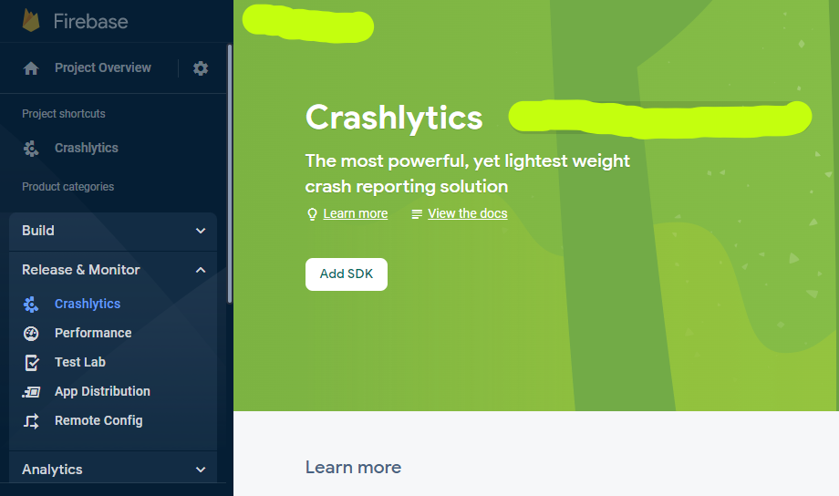
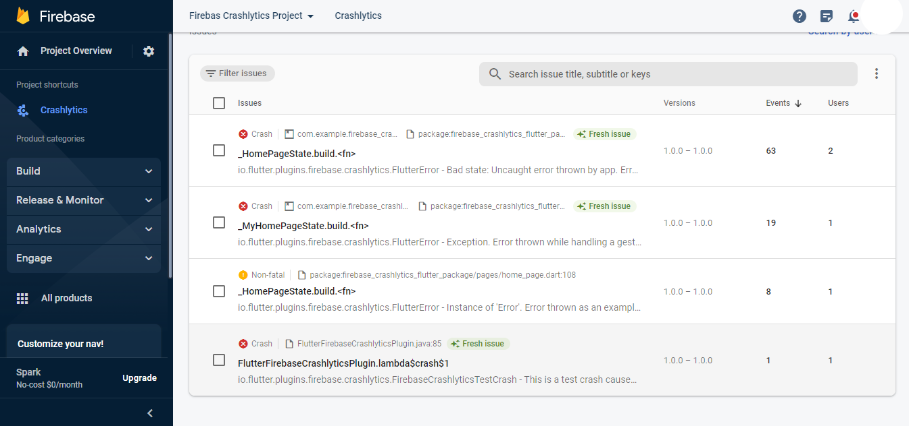
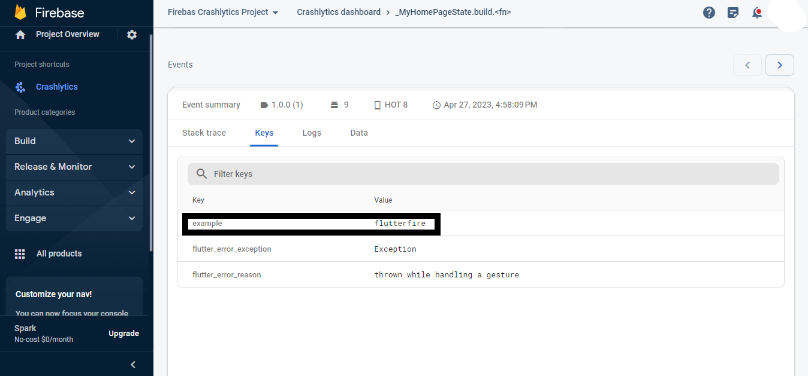
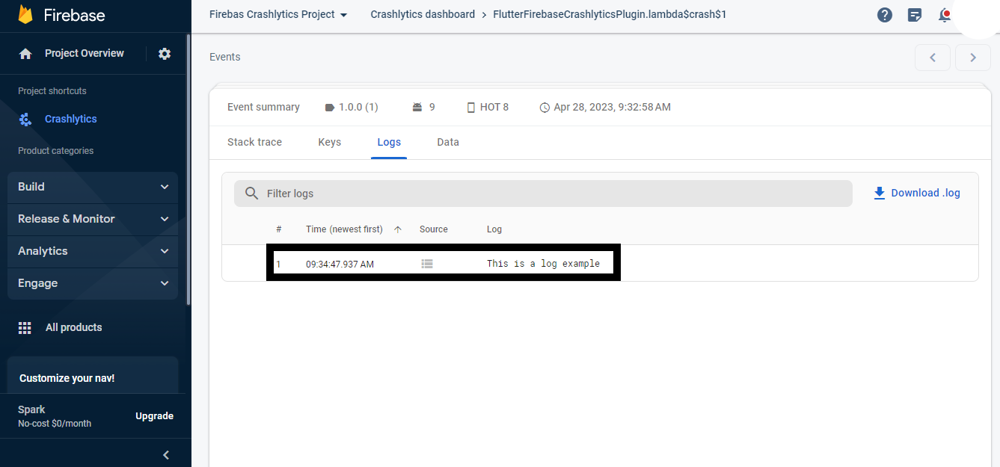
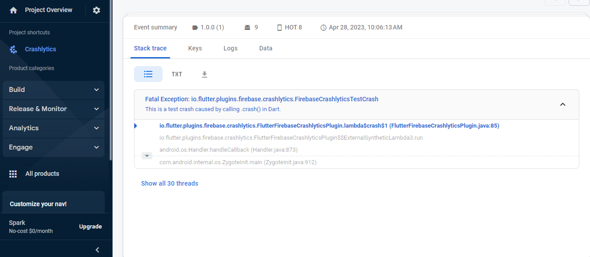
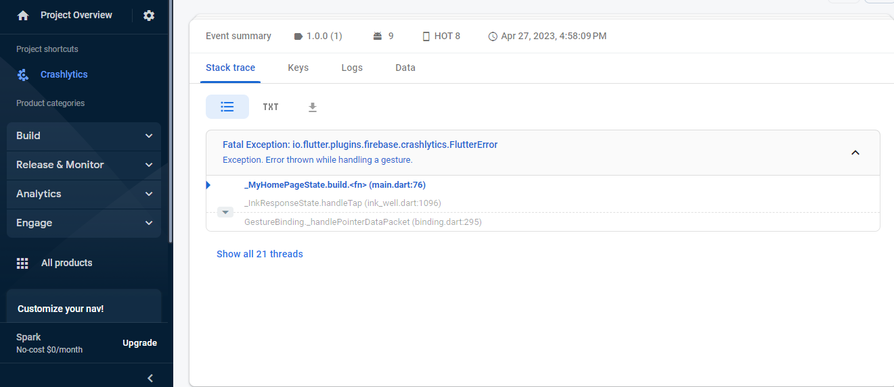
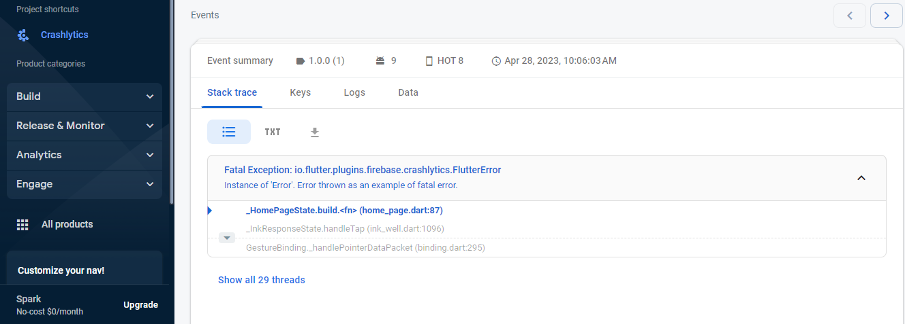
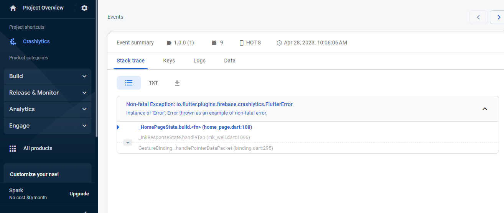

# firebase_crashlytics_flutter_package

A new Flutter project.

## Getting Started

This project is a starting point for a Flutter application.

A few resources to get you started if this is your first Flutter project:

- [Lab: Write your first Flutter app](https://docs.flutter.dev/get-started/codelab)
- [Cookbook: Useful Flutter samples](https://docs.flutter.dev/cookbook)

For help getting started with Flutter development, view the
[online documentation](https://docs.flutter.dev/), which offers tutorials,
samples, guidance on mobile development, and a full API reference.

## 1. Research: Firebase Crashlytics Flutter Package

- Keywords:
    - firebase crashlytics flutter
    - firebase_crashlytics flutter package
    - firebase crashlytics flutter ios not working
    - firebase crashlytics flutter example
    - firebase_crashlytics pub dev
    - firebase crashlytics flutter ios
    - firebase crashlytics android
    - firebase crashlytics not reporting crashes android
    - firebase crashlytics github
    - firebase crashlytics collection enabled
    - firebase crashlytics platform interface
- Video Title: Firebase Crashlytics Flutter Package - Firebase Crashlytics Flutter for Android with
  Example and Github Code

## 2. Research: Competitors

**Flutter Videos/Articles**

- 3.6K: https://youtu.be/ODpvVvJdKLQ
- 8.4K: https://youtu.be/cIFLFpKTy7c
- 3.1K: https://youtu.be/VmAoOYfIDYQ
- 15K: https://youtu.be/DFcr0k2nrP4
- 1K: https://youtu.be/1eMJqwlB-bI
- 73: https://youtu.be/2jPB6Q-Mjac
- 78: https://youtu.be/BqBM2SCO_4M
- 1.7K: https://youtu.be/tLXq1EowZVk
- https://pub.dev/packages/firebase_crashlytics
- https://firebase.flutter.dev/docs/crashlytics/overview/
- https://firebase.google.com/docs/crashlytics/customize-crash-reports?hl=en&authuser=0&platform=flutter
- https://dev.to/gulsenkeskin/using-firebase-crashlytics-with-flutter-4a1f
- https://medium.flutterdevs.com/crashlytics-in-flutter-bf2af198b382
- https://firebase.google.com/docs/crashlytics
- https://nhancv.medium.com/flutter-crashlytics-integration-17530e24ba5c
- https://dev-yakuza.posstree.com/en/flutter/firebase/crashlytics/
- https://medium.com/google-developer-experts/firebase-crashlytics-flutter-2b313ed758b6

**Android/Swift/React Videos**

- 8.7K: https://youtu.be/s2ZY9ketQXQ
- 3.9K: https://youtu.be/i66ZTIMcqrc
- 6.6K: https://youtu.be/JxVYfZprK0g
- 1.4K: https://youtu.be/Ire9yQg4OFA
- 9.5K: https://youtu.be/sH4rPPy9ROA
- 2.5K: https://youtu.be/GWS76WtI5y8
- 15K: https://youtu.be/G2RVTkKgas0
- 24K: https://youtu.be/qFQLG1Hlzis
- 2.7K: https://youtu.be/PHkfjxCTS5w
- 1.2K: https://youtu.be/infKu-sxCFQ
- 7.6K: https://youtu.be/BpVfJ7mVlUU
- 22K: https://youtu.be/dc71XX-zJtE
- 4.5K: https://youtu.be/VCa_ZFXm_9A
- 8.7K: https://youtu.be/s2ZY9ketQXQ
- 6.1K: https://youtu.be/YOSzluAmNuE
- 32K: https://youtu.be/2jMcmEsWlm0
- https://developer.android.com/studio/debug/app-quality-insights
- https://firebase.google.com/docs/crashlytics/get-started
- https://medium.com/codechai/integrate-firebase-crashlytics-in-android-d4712441a5bd
- https://firebasetutorials.com/firebase-crashlytics/
- https://medium.com/@paulsoham/firebase-crashlytics-in-ios-swift-1d8c9aec63d0
- https://medium.com/swlh/integrating-firebase-and-crashlytics-in-ios-complete-guide-updated-2019-4526e9ab9c6d
- https://iostutorialjunction.com/2022/02/integrate-google-firebase-crashlytics-in-ios-app-using-swift.html
- https://rnfirebase.io/crashlytics/usage
- https://www.npmjs.com/package/@react-native-firebase/crashlytics
- https://www.folio3.com/mobile/blog/firebase-crashlytics-integration-in-react-native/
- https://blog.logrocket.com/guide-crashlytics-react-native/

**Great Features**

- This package is used for Firebase Crashlytics. It reports uncaught errors to the Firebase console.

**Problems from Videos**

- Question: How long did it take for you to see the crash in the Firebase Console? ... I forced the
  crash, but I've got nothing.

Answer: 5-15 mins. If still now showing, check your steps again.

**Problems from Flutter Stackoverflow**

- https://stackoverflow.com/questions/74267630/catch-error-isnt-called-after-firebasecrashlytics-instance-crash-with-flutt
- https://stackoverflow.com/questions/69706527/firebase-crashlytics-still-pending-flutter
- https://stackoverflow.com/questions/72360215/how-to-make-the-error-title-and-stacktrace-in-firebase-crashlytics-readable
- https://stackoverflow.com/questions/73298113/firebase-crashlytics-is-not-reporting-anything-on-flutter
- https://stackoverflow.com/questions/69053807/firebase-crashlytics-not-working-in-flutter-android
- https://stackoverflow.com/questions/74511640/firebase-crashlytics-reporting-mystery-crashes
- https://stackoverflow.com/questions/63949075/getting-error-while-using-firebase-crashlytics-with-flutter
- https://stackoverflow.com/questions/72764885/how-to-add-firebase-crashlytics-to-flutter-project

## 3. Video Structure

**Main Points / Purpose Of Lesson**

1. In this video, you will learn how to use firebase_crashlytics package to send reports and
   uncaught errors to the firebase console.
2. Main points:
    - Set custom key
    - Show log in firebase
    - Crashlytics crash
    - Throw app error
    - Record fatal error
    - Record non-fatal error
3. This package is very helpful and easily track the errors and exceptions in flutter app.

**The Structured Main Content**

1. Run `dart pub add firebase_crashlytics` in terminal to add this package in your project's
   pubspec.yaml file.
2. Also add `firebase_core` package because it handles integration of flutter app with firebase.
3. We test this package for android only. UI output of this code is following:
   <br/>
4. Follow [this](https://www.youtube.com/watch?v=sz4slPFwEvs) to integrate your flutter android app
   with firebase.
5. After integration, follow
   the [Add SDK](https://firebase.google.com/docs/crashlytics/get-started?platform=android#add-sdk)
   method to enable Crashlytics of your app.
   
    - In android/app/build.gradle => Set minSdkVersion to 19,

      Add `apply plugin: 'com.google.firebase.crashlytics'`.
    - In android/build.gradle =>
      Add `classpath 'com.google.firebase:firebase-crashlytics-gradle:2.9.5'`
6. After adding sdk, you will be able to enable Crashlytics in firebase.
7. In `main.dart` file, initialize firebase core and firebase crashlytics.

```dart
void main() async {
  WidgetsFlutterBinding.ensureInitialized();
  await Firebase.initializeApp();

  FlutterError.onError = (errorDetails) {
    FirebaseCrashlytics.instance.recordFlutterFatalError(errorDetails);
  };

  PlatformDispatcher.instance.onError = (error, stack) {
    FirebaseCrashlytics.instance.recordError(error, stack, fatal: true);
    return true;
  };

  runApp(const MyApp());
}
```

- To send error which flutter can catch, use `FlutterError.onError`.

If you wish to record a "non-fatal" exception, please
use `FirebaseCrashlytics.instance.recordFlutterError` instead.

- Pass all uncaught asynchronous errors that aren't handled by the Flutter framework to Crashlytics
  in `PlatformDispatcher.instance.onError`.

If you wish to record a "non-fatal" exception, please remove the "fatal" parameter.

- `home` property of `MaterialApp` is calling `HomePage` widget from `home_page.dart` file.

8. `custom_widgets.dart` contains code to hide and show the snackBar when user press on button. It
   is used in `home_page.dart`.

```dart
import 'package:flutter/material.dart';

class CustomWidgets {
  static buildSnackBar(BuildContext context, String message) {
    ScaffoldMessenger.of(context)
      ..removeCurrentSnackBar()
      ..showSnackBar(
        SnackBar(
          content: Text(message),
          duration: const Duration(seconds: 5),
        ),
      );
  }
}
```

9. `home_page.dart` contains `ElevatedButton`s in column according to main points.

Screenshot of HomePage of Crashlytics page on firebase console is following:



- Set Custom Key

```dart 

              ElevatedButton(
                onPressed: () {
                  FirebaseCrashlytics.instance
                      .setCustomKey('example', 'flutterfire');
                  CustomWidgets.buildSnackBar(
                    context,
                    'Custom Key "example: flutterfire" has been set. \n'
                    'Key will appear in Firebase Console once an error has been reported.',
                  );
                },
                child: const Text('Set Custom Key'),
              ),
```

Output in firebase console:



- Show Log in Firebase

```dart 
              ElevatedButton(
                onPressed: () {
                  FirebaseCrashlytics.instance.log('This is a log example');
                  CustomWidgets.buildSnackBar(
                    context,
                    'The message "This is a log example" has been logged. \n'
                    'Message will appear in Firebase Console once an error has been reported.',
                  );
                },
                child: const Text('Show Log in Firebase'),
              ),
```

Output in firebase console:



- Crashlytics Crash => After showing snackBar, `sleep` from `dart:io` is called delay in crash for 5
  seconds.

Then crash is called to throw an error. Used for confirmation that errors are being correctly
reported. App will crash. When you will reopen app, it will send crash report to firebase console.

```dart 
              ElevatedButton(
                onPressed: () {
                  CustomWidgets.buildSnackBar(
                    context,
                    'App will crash is 5 seconds \n'
                    'Please reopen to send data to Crashlytics',
                  );
                  sleep(
                    const Duration(seconds: 5),
                  );
                  FirebaseCrashlytics.instance.crash();
                },
                child: const Text("Crashlytics Crash"),
              ),
```

Output in firebase console:



- Throw Error => Example of thrown error, it will be caught and sent to Crashlytics.

```dart 
              ElevatedButton(
                onPressed: () {
                  CustomWidgets.buildSnackBar(
                    context,
                    'Thrown error has been caught and sent to Crashlytics.',
                  );
                  throw StateError('Uncaught error thrown by app');
                },
                child: const Text("Throw Error"),
              ),
```

Output in firebase console:



- Record Fatal Error => "reason" will append the word "thrown" in the Crashlytics console.

`fatal` property is set to `true`.

```dart 
              ElevatedButton(
                onPressed: () async {
                  try {
                    CustomWidgets.buildSnackBar(
                      context,
                      'Recorded Fatal Error',
                    );
                    throw Error();
                  } catch (e, s) {
                    await FirebaseCrashlytics.instance.recordError(
                      e,
                      s,
                      reason: 'as an example of fatal error',
                      fatal: true,
                    );
                  }
                },
                child: const Text('Record Fatal Error'),
              ),
```

Output in firebase console:



- Record Fatal Error => "reason" will append the word "thrown" in the Crashlytics console.

only `fatal` is set to `false`. It is by default `false`.

```dart 
              ElevatedButton(
                onPressed: () async {
                  try {
                    CustomWidgets.buildSnackBar(
                      context,
                      'Recorded Non-Fatal Error',
                    );
                    throw Error();
                  } catch (e, s) {
                    await FirebaseCrashlytics.instance.recordError(
                      e,
                      s,
                      reason: 'as an example of non-fatal error',
                    );
                  }
                },
                child: const Text('Record Non-Fatal Error'),
              ),
```

Output in firebase console:

